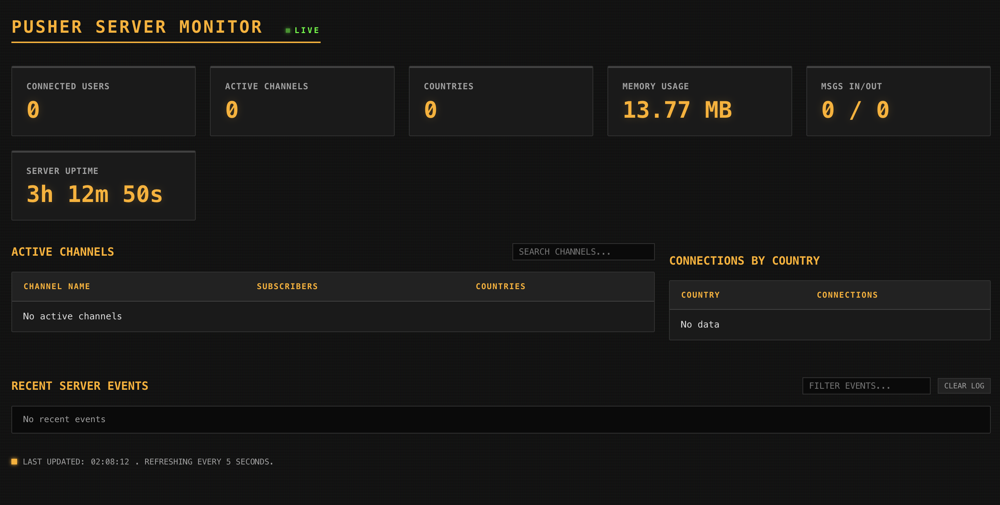

# Custom Pusher-compatible Realtime Server

[](https://opensource.org/licenses/MIT)
[](https://nodejs.org/)
[](CONTRIBUTING.md)

A custom-built, lightweight WebSocket server that implements the Pusher protocol. This project allows you to use standard Pusher client libraries (like `pusher-js`) without needing an account or connection to the official Pusher service. Ideal for local development, private networks, or cost-effective real-time applications.

## 🚀 Features

- **Pusher Protocol Compatibility**: Drop-in replacement for the `pusher-js` client.
- **WebSocket Based**: High-performance, low-latency real-time communication.
- **Real-time Monitoring**: Built-in dashboard to track connections, channels, and events.
- **No External Dependencies**: Run your own infrastructure without third-party services.
- **Easy Integration**: Includes ready-to-use examples for Web and Mobile (React Native).
- **Production Ready**: Includes guides for hosting on Cloudways and handling proxies.

## 🛠 Setup

### 1. Installation
Clone the repository and install dependencies:
```bash
git clone https://github.com/your-username/mypusher.git
cd mypusher
npm install
```

### 2. Configure Allowed Origins
You can configure which domains are allowed to connect to your WebSocket server using either a configuration file or an environment variable.

#### Option A: Configuration File (Recommended for Local Dev)
Copy the example configuration and add your domains:
```bash
cp allowed_origins.json.example allowed_origins.json
```
Edit `allowed_origins.json` to include your application's domain. Wildcards (e.g., `*.onrender.com`) are supported.

#### Option B: Environment Variable (Recommended for Production)
Set the `ALLOWED_ORIGINS` environment variable with a comma-separated list of domains:
```bash
export ALLOWED_ORIGINS="localhost, *.yourdomain.com, another-app.onrender.com"
```
This is the preferred method when deploying to platforms like Render, Heroku, or DigitalOcean.

### 3. Start the Server
```bash
node server.js
```
The server will start on port `3000` by default.

#### Command Line Flags
You can also use flags to override configuration:
- `--port` or `-p`: Set the port (e.g., `node server.js --port 4000`)
- `--env` or `-e`: Specify a custom `.env` file (e.g., `node server.js --env .env.prod`)

## 📊 Monitoring

The server includes a built-in real-time monitoring dashboard with a retro "Amber Terminal" interface.



### Accessing the Dashboard
1. Start the server.
2. Navigate to `http://localhost:3000/monitor` in your browser.
3. Authenticate using the default credentials (or your configured ones):
   - **Username**: `admin`
   - **Password**: `password`

### Features tracked:
- **Live Connection Stats**: Number of connected users and active channels.
- **Global Reach**: Track connections by country.
- **Server Health**: Memory usage and server uptime.
- **Message Throughput**: Real-time count of incoming and outgoing messages.
- **Event Log**: Live stream of server events for debugging.

You can configure the dashboard credentials using the `MONITOR_USERNAME` and `MONITOR_PASSWORD` environment variables.

## 📱 Client Integration

### Web Client
Open `index.html` in your browser. It's pre-configured to connect to `localhost:3000`.

```javascript
const pusher = new Pusher('any-key', {
  wsHost: '127.0.0.1',
  wsPort: 3000,
  forceTLS: false,
  disableStats: true,
  enabledTransports: ['ws', 'wss']
});
```

### Mobile Client (React Native)
The `MobileApp.js` file provides a React Native component example.
1. Update `YOUR_SERVER_IP` to your computer's local IP address.
2. Ensure your mobile device is on the same network as the server.

## 📡 API Endpoints

- `POST /message`: Broadcast a message to a channel.
  - Body: `{ "channel": "my-channel", "event": "my-event", "data": { "message": "hello" } }`
- `POST /pusher/auth`: Mock authentication endpoint for private/presence channels.

## ☁️ Cloud Hosting

Detailed instructions for hosting:

- [Cloudways Hosting Guide](./CLOUD_HOSTING.md)
- [DigitalOcean VPS Hosting Guide](./DIGITAL_OCEAN_HOSTING.md)
- [Render Hosting Guide](./RENDER_HOSTING.md)

## 🤝 Contributing

Contributions are welcome! Please see [CONTRIBUTING.md](CONTRIBUTING.md) for guidelines.

## 📄 License

This project is licensed under the MIT License - see the [LICENSE](LICENSE) file for details.
